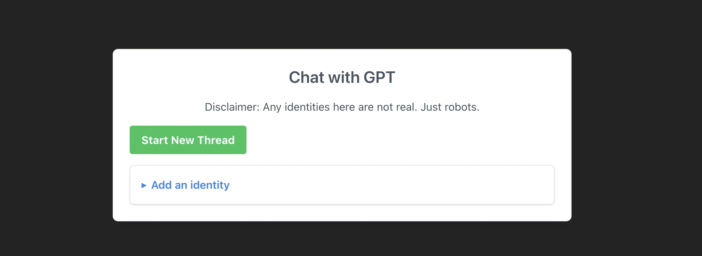

# Chat with GPT


A chat application using the [OpenAI API](https://platform.openai.com/docs/api-reference) along with [Convex](https://www.convex.dev/). In this setup, Convex stores the messages and handles server-side functions for interacting with OpenAI.

This app started with a minimal setup to get React working in Vite with HMR and some ESLint rules and from the official ChatGPT Convex demo.

**Features:**

- Have a conversation with the Chat GPT API.
- Start new threads to create new conversation with Chat GPT.
- Specify what the chat identity is and change it mid-thread.
- Create new identities/AI agents.
- Moderate user inputs for offensive content by using the moderation API.


https://github.com/jun-low/chat-with-gpt/assets/50255944/9e9ad772-c5cf-4ed3-9059-5bfcfc43cb9f

https://github.com/jun-low/chat-with-gpt/assets/50255944/f419472b-d080-442e-a34a-712090e4cc18


## Expanding the ESLint configuration

If you are developing a production application, we recommend updating the configuration to enable type aware lint rules:

- Configure the top-level `parserOptions` property like this:

```js
   parserOptions: {
    ecmaVersion: 'latest',
    sourceType: 'module',
    project: ['./tsconfig.json', './tsconfig.node.json'],
    tsconfigRootDir: __dirname,
   },
```

- Replace `plugin:@typescript-eslint/recommended` to `plugin:@typescript-eslint/recommended-type-checked` or `plugin:@typescript-eslint/strict-type-checked`
- Optionally add `plugin:@typescript-eslint/stylistic-type-checked`
- Install [eslint-plugin-react](https://github.com/jsx-eslint/eslint-plugin-react) and add `plugin:react/recommended` & `plugin:react/jsx-runtime` to the `extends` list
